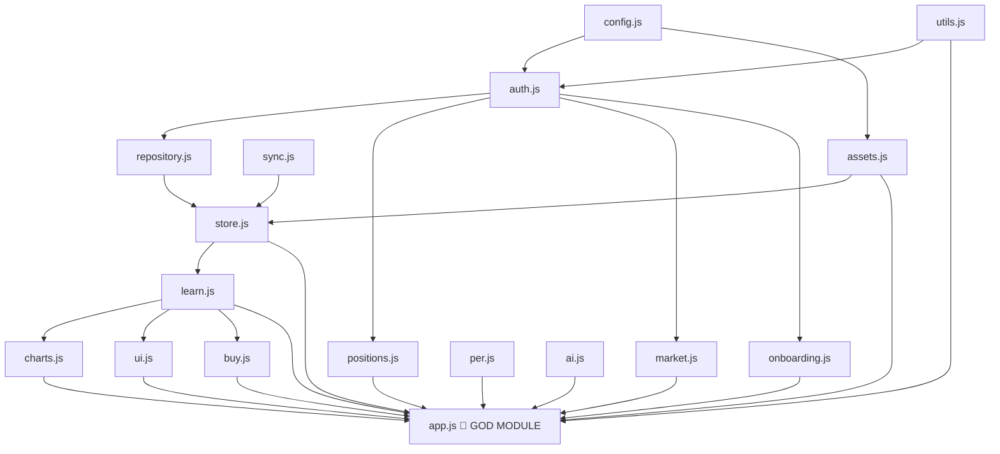

# InvestSmart — Architecture Document

> Última actualización: v3 (2026-06-18)

---

## 1. Resumen ejecutivo

InvestSmart es una SPA estática (sin build step) desplegada en GitHub Pages. Usa Vanilla JS ES Modules como frontend, Supabase como backend (auth + DB + Edge Functions) y Yahoo Finance + Groq como servicios externos. El código es funcional y bien estructurado en sus módulos hoja, pero **`app.js` es un god module** que concentra demasiada responsabilidad y representa el principal riesgo de mantenibilidad a futuro.

---

## 2. Stack tecnológico

| Capa | Tecnología |
|---|---|
| Frontend | Vanilla JS ES Modules, Chart.js, Inter + Space Grotesk |
| Auth + DB | Supabase JS v2 (JWT auto-refresh, persistSession: true) |
| Backend | Supabase Edge Functions (Deno runtime) |
| Market data | Yahoo Finance API (crumb auth 2025) vía Edge Function proxy |
| AI | Groq API — `llama-3.3-70b-versatile` vía Edge Function |
| Styling | CSS custom properties — sin framework |
| Deploy | GitHub Pages (static) + `npx serve` local |
| Cache offline | Service Worker stale-while-revalidate (cache: `investsmart-v6`) |

---

## 3. Mapa de módulos

```
config.js       — constantes: SUPA_URL, SUPA_KEY, EDGE_BASE, ASSET_META, ASSETS
utils.js        — esc(), toast(), set(), attachTickerSearch(), createCache()
sync.js         — setSyncState() — dot de estado en sidebar
auth.js         — db (único Supabase client), login, signup, signOut, changePassword
    ↓
repository.js   — SessionRepo: queries Supabase para sessions
assets.js       — getAllAssets(), addCustomAsset(), removeCustomAsset()
positions.js    — getPositions(), addPurchase(), removePurchase(), loadPositions(), renderPositionsPanel()
    ↓
store.js        — Store singleton: history[], _syncCloud(), add(), reset()
    ↓
learn.js        — Learn singleton: train(), riskScore, recommendations
    ↓
charts.js       — Charts: value(), returns(), sector() — Chart.js wrappers
ui.js           — UI: kpis(), table(), returnInputs(), history(), recs()
per.js          — renderWatchlist(), analyzeTickerPer(), evaluateAllPer()
ai.js           — fetchAiAnalysis(), renderAiPage(), clearAiCache()
buy.js          — analyzeBuy(), loadBuySlots(), clearBuySlot(), autoRecommend()
market.js/prices.js — fetchMarketData() — live prices sidebar
onboarding.js   — showOnboarding(), isOnboardingDone() — wizard 3 pasos
    ↓
app.js          — ENTRY POINT: importa todo, expone window.*, bootstrap
```

### DAG de dependencias (sin ciclos — correcto)



---

## 4. Flujo principal de datos

```
Browser load
    → sw.js (cache hit si disponible)
    → index.html + ES Modules
    → app.js bootstrap IIFE
        → db.auth.getSession()
        → startApp(session)
            → Store.load(userId)        — localStorage fallback
            → Learn.train(history)
            → UI.all()                  — render inmediato desde cache
            → Store._syncCloud()        — async: fetch Supabase
                → Learn.train() again
                → UI.all() again
            → fetchMarketData()         — Edge Function market-data
            → loadPositions()           — Edge Function → user_positions
            → loadBuySlots()            — localStorage restore
```

---

## 5. Modelo de datos

### Supabase tables

```sql
sessions (
  id uuid PK,
  user_id uuid FK auth.users,
  fecha date,
  fase text,               -- descripción generada por Learn
  valor_total_usd numeric,
  rendimientos jsonb,      -- { "VOO": 12.5, "NVDA": -3.2, ... }
  created_at timestamptz
)

user_positions (
  user_id uuid PK FK,     -- una fila por usuario
  data jsonb,             -- { "VOO": { purchases: [{date, shares, price}] }, ... }
  updated_at timestamptz
)

api_usage (
  id uuid PK,
  user_id uuid FK,
  endpoint text,          -- 'market-data' | 'ai-analysis'
  created_at timestamptz
)
```

### localStorage keys

| Key | Contenido |
|---|---|
| `investsmart-v3/v4` | sessions history (legacy, migrado a Supabase) |
| `investsmart-positions` | positions cache (mirror de Supabase) |
| `investsmart-last-cash` | último capital en efectivo (mirror de user_metadata) |
| `investsmart-custom-assets` | activos personalizados del usuario |
| `investsmart-onboarding-done` | flag para skip del wizard |
| `investsmart-buy-slots` | últimos tickers analizados en buy slots |
| `investsmart-ai-cache` | caché AI analysis (TTL 30min) |
| `investsmart-buy-{ticker}` | caché buy analysis por ticker |

---

## 6. Edge Functions

### market-data
- **Modo precios:** `{ tickers: string[] }` → Yahoo Finance quoteSummary
- **Modo búsqueda:** `{ search: string }` → Yahoo Finance search
- **Seguridad:** JWT requerido, ticker whitelist `/^[A-Z0-9.\-]{1,10}$/`, max 20 tickers, rate limit 60/hr
- **CORS:** lista explícita de orígenes permitidos

### ai-analysis
- **Modo portfolio:** `{ mode: 'suggest', portfolio }` → Groq recomendaciones
- **Modo buy:** `{ mode: 'buy', ticker, marketData, portfolio }` → veredicto COMPRAR/ESPERAR/EVITAR
- **Seguridad:** JWT requerido, sanitización server-side de portfolio object, rate limit 20/hr
- **GROQ_API_KEY:** Supabase Secret — nunca en código commitado

---

## 7. Fortalezas actuales

- ✅ **DAG limpio** — sin imports circulares
- ✅ **Single Supabase client** — `db` creado una sola vez en auth.js
- ✅ **XSS prevention** — `esc()` usado consistentemente en innerHTML
- ✅ **RLS en todas las tablas** — `auth.uid() = user_id` en sessions, user_positions, api_usage
- ✅ **Rate limiting** en ambas Edge Functions
- ✅ **CORS dinámico** — sin wildcard `*`
- ✅ **Ticker whitelist** server-side en Edge Functions
- ✅ **Sanitización de prompt** server-side (anti prompt injection en Groq)
- ✅ **Offline-first** — localStorage como cache, Supabase como source of truth
- ✅ **Cross-device** — positions y cash sync vía Supabase

---

## 8. Debilidades y riesgos

### 🔴 Crítico — app.js god module

`app.js` tiene ~570 líneas y mezcla 7 responsabilidades distintas:

| Responsabilidad | Debería estar en |
|---|---|
| Navegación (`goTo`, sidebar) | `src/router.js` |
| Quick record flow | `src/record.js` |
| Position form handlers | `src/positions.js` |
| Custom asset form | `src/assets.js` |
| AI trigger logic | `src/ai.js` |
| Window bindings (~30) | `src/bindings.js` |
| App lifecycle + bootstrap | `src/app.js` (solo esto) |

**Riesgo:** Cualquier feature nueva termina en app.js. Ya tiene race condition potencial en `_qrData`.

### 🔴 Crítico — `renderPositionsPanel()` en positions.js

Violación SRP: un módulo de datos contiene lógica de render con HTML/CSS inline. Hace imposible testear la data layer sin el DOM.

### 🟡 Medio — `window.*` coupling fuerte

~30 funciones expuestas a `window` desde app.js. HTML inline handlers (`onclick="goTo()"`) están acoplados a nombres de función. Un refactor de nombres rompe la UI silenciosamente.

**Mitigación sin reescritura:** centralizar todos los bindings en `bindings.js` que solo hace `window.X = modulo.X` sin lógica propia.

### 🟡 Medio — `_qrData` mutable shared state

`let _qrData = null` en scope de módulo. Si `quickRecord()` se llama dos veces antes de que complete (doble click rápido), el segundo cálculo sobreescribe el primero y el botón podría quedar en estado inconsistente. El `btn.disabled = true` mitiga parcialmente pero no completamente.

### 🟡 Medio — Inline CSS en renderPositionsPanel

HTML generado en positions.js usa `style=""` inline extensivo. Difícil de mantener, imposible de themar, no respeta el design system de `styles.css`.

### 🟡 Medio — console.error leaks menores

- `app.js` línea ~114: `console.error('[ai-analysis]', err)` — leak de error interno
- `store.js` línea ~58: `console.error('Seed error:', error.code, error.message)` — leak de código Supabase

### 🟢 Bajo — Sin validación de shape en loadPositions()

`positions.js` guarda el JSON de Supabase en localStorage sin validar la estructura. Si la DB devuelve datos malformados (o corrupts), localStorage queda contaminado.

---

## 9. Roadmap de mejoras (priorizado)

### v4 — Separación de responsabilidades (sin cambiar comportamiento)

**Paso 1:** Extraer `src/bindings.js`
```javascript
// bindings.js — solo asignaciones, sin lógica
import { goTo, toggleSidebar, ... } from './app.js';
import { analyzeBuy, ... } from './buy.js';
window.goTo = goTo;
window.analyzeBuy = analyzeBuy;
// ...
```
Beneficio: app.js pierde 40 líneas, los bindings quedan en un solo lugar auditaable.

**Paso 2:** Mover `renderPositionsPanel()` a `ui.js`
```javascript
// ui.js
export function positionsPanel() { /* HTML render */ }
```
```javascript
// positions.js — solo data, sin DOM
export function getPositions() { ... }
export async function addPurchase() { ... }
```

**Paso 3:** Extraer `src/record.js`
```javascript
// record.js — quick record flow completo
export async function quickRecord() { ... }
export function applyQuickRecord() { ... }
export function clearSavedCash() { ... }
// _qrData encapsulado aquí, no en app.js
```

### v5 — Robustez y calidad

- Validar shape de datos en `loadPositions()` antes de guardar en localStorage
- Reemplazar `console.error` restantes con logging controlado (o eliminar)
- Reemplazar inline CSS en renderPositionsPanel con clases CSS de `styles.css`
- Añadir `btn.disabled` guard en `savePosition()` para evitar doble submit

### v6 — Testing

- Unit tests para: `getAvgPrice()`, `getTotalShares()`, `Learn.train()`, `esc()`, `createCache()`
- No requieren DOM ni Supabase — son funciones puras
- Tool sugerida: Deno test runner (consistente con el runtime de Edge Functions)

---

## 10. Principios SOLID aplicados y violaciones

| Principio | Estado | Detalle |
|---|---|---|
| SRP | ⚠️ Violado | app.js, positions.js (render + data) |
| OCP | ✅ OK | Edge Functions usan `mode` para extender sin modificar flujo base |
| LSP | ✅ N/A | Sin herencia en el proyecto |
| ISP | ✅ OK | Módulos hoja tienen interfaces pequeñas y enfocadas |
| DIP | ⚠️ Parcial | app.js importa `db` directamente — aceptable sin framework DI |

---

## 11. OWASP Top 10 — estado actual

| Categoría | Estado | Notas |
|---|---|---|
| A01 Broken Access Control | ✅ | RLS en todas las tablas, JWT en Edge Functions |
| A02 Security Misconfiguration | ✅ | CORS explícito, GROQ_KEY como Secret |
| A03 Supply Chain | 🟡 | `esm.sh` en Edge Functions — no hay lockfile de deps |
| A05 Injection | ✅ | esc() en frontend, sanitización server-side en Groq prompt |
| A06 Insecure Design | 🟡 | console.error menores, _qrData race condition |
| A09 Logging | 🟡 | 2 console.error con detalles internos pendientes de limpiar |
| A10 SSRF | ✅ | Edge Function solo llama a dominios hardcoded (Yahoo Finance) |
